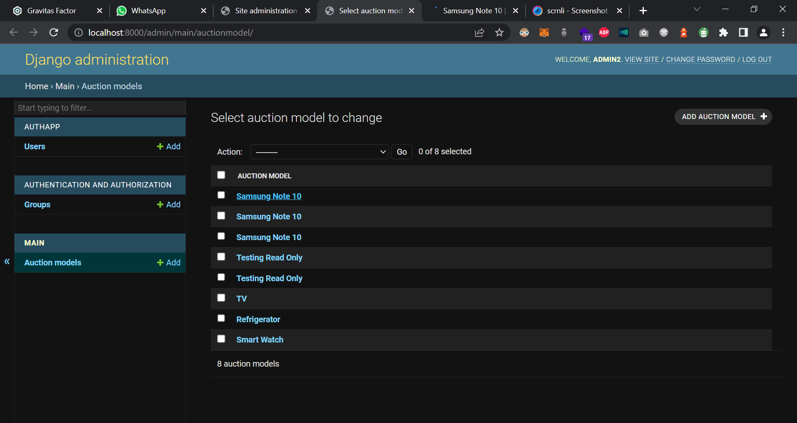

# To run backend - 
```
cd backend
env\Scripts\activate.bat
cd auction 
python manage.py runserver
```

# To run frontend -
```
cd frontend
npm run dev
```

# for developers -
pip freeze > requirements.txt

superuser - admin

email - admin@gmail.com

password - admin@123


## user generation tips -
username - jignesh, harman
email - jignesh@gmail.com, harman@gmail.com
password - ignesh@1234, arman@1234 # drop 1st letter
first_name - jignesh, harman
last_name - patil, singh
usertype - Not staff, staff

## admin/Superuser account credentials -
Username: admin2
Email: admin2@gmail.com
Password: dmin2@1234
Password (again): dmin2@1234
Superuser created successfully.

## to start celery worker -
```
celery -A auction.celery worker --loglevel=info (do this inside outermost auction folder => celery -A myproject.celery worker --loglevel=info)
celery -A celery worker --loglevel=info 
```

Payment link 
```
https://rzp.io/l/rxLxyVp
```

## ERRORS :
if "django.db.utils.OperationalError: no such table: main_auctionmodel" this error comes then
python manage.py migrate --run-syncdb  => Creates tables for apps without migrations
python manage.py makemigrations main => specify name
python manage.py migrate main => specify name

## STAR THIS REPOSITORY IF LOVED OUR EFFORTS!

## Contributors 😎 <p align="center"> 
Backend - <a href="https://github.com/KedarKK1/auction_website_WTL/graphs/contributors">  </a> 

<br />
Frontend - <a href="https://github.com/KedarKK1/auction_frontend_WTL/graphs/contributors">  </a>  
</p>

# Event Screenshots


<!--  -->




